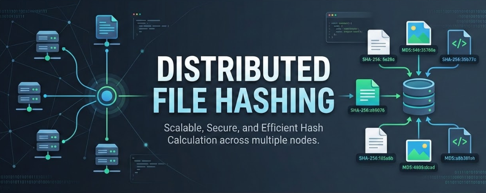

# HashCluster
<p align="center">
  
</p>


Calcul distribué de hachages SHA-256 sur un cluster Erlang/Elixir. HashCluster scanne un répertoire, distribue les fichiers entre plusieurs nœuds de calcul et présente les résultats en temps réel via une interface web.

- **Backend** : Elixir/OTP — GenServer, distribution Erlang, Mnesia
- **Frontend** : Phoenix LiveView — temps réel sans JavaScript custom
- **Stockage** : Mnesia en RAM (données non persistantes)

---

## Fonctionnalités

- Scan récursif en streaming — les répertoires volumineux sont traités sans charger la liste complète en mémoire
- Distribution équitable entre nœuds via un modèle pull (les workers demandent des batches)
- Chargement de code automatique — les workers n'ont pas besoin du code source, le master pousse les modules `.beam` au moment de la connexion
- Gestion des fichiers problématiques : droits insuffisants, erreurs de lecture, timeout → enregistrés avec statut explicite, comptés dans la progression
- Deux pools de traitement séparés : fichiers normaux (< 512 Mo, 8 en parallèle, timeout 2 min) et gros fichiers (≥ 512 Mo, 2 en parallèle, timeout dynamique jusqu'à 2h)
- Ajout de workers en cours d'analyse
- Export JSON des résultats
- Recherche par nom de fichier

---

## Architecture

```
┌─────────────────────────────────────────────────────┐
│                    Nœud Maître                      │
│                                                     │
│  Phoenix LiveView ──► Coordinator ──► MnesiaStore   │
│         ▲                  │                        │
│         │            dispatch batches               │
│    NodeMonitor         ────┼────────────────┐       │
│    NodeLoader              │                │       │
│    CancelFlag              ▼                ▼       │
│                       FileWorker       FileWorker   │
│                       (local)          (via RPC)    │
└────────────────────────────┬────────────────────────┘
                             │ Erlang Distribution
              ┌──────────────┴──────────────┐
              ▼                             ▼
       ┌─────────────┐               ┌─────────────┐
       │  Worker 1   │               │  Worker 2   │
       │ FileWorker  │               │ FileWorker  │
       │ (code pushé)│               │ (code pushé)│
       └─────────────┘               └─────────────┘
```

Le master distribue des batches de 30 fichiers. Chaque worker en reçoit jusqu'à 3 en avance (prefetch) pour éviter les temps morts réseau. Quand un batch est terminé, le worker en redemande un nouveau en signalant la fin du précédent dans le même appel RPC.

---

## Prérequis

### Sur le nœud maître

Elixir ≥ 1.17, Erlang/OTP ≥ 26, et les dépendances du projet.

**NixOS avec Flakes (recommandé) :**
```bash
# Activer les flakes dans /etc/nixos/configuration.nix :
# nix.settings.experimental-features = [ "nix-command" "flakes" ];

cd hashcluster
nix develop       # entre dans l'environnement avec Elixir + Erlang
```

**NixOS sans flakes :**
```bash
nix-shell -p elixir erlang inotify-tools
```

**Autres distributions :**
Installer Elixir et Erlang via le gestionnaire de paquets de votre distribution, puis vérifier :
```bash
elixir --version   # ≥ 1.17
erl +V             # ≥ OTP 26
```

### Sur les nœuds workers

Uniquement Elixir + Erlang. **Le code source n'est pas nécessaire** — le master pousse automatiquement les modules compilés via le réseau Erlang.

---

## Installation

```bash
# 1. Dépendances Hex
mix local.hex --force
mix local.rebar --force

# 2. Dépendances du projet
mix deps.get

# 3. Compilation
mix compile
```

---

## Démarrage

### Mode mono PC (standalone)

```bash
./start_master.sh
```

L'interface est disponible sur **http://localhost:4000**.

Le master se connecte à lui-même comme worker — le calcul utilise les cœurs locaux uniquement.

### Mode cluster (maître + workers)

#### 1. Démarrer le maître

Sur la machine maître (ex: `192.168.1.10`) :

```bash
MASTER_NODE=master@192.168.1.10 \
CLUSTER_COOKIE=mon_secret_partage \
./start_master.sh
```

#### 2. Démarrer les workers

Sur chaque machine worker — **aucune copie du projet nécessaire**, uniquement Elixir installé :

```bash
# Copier uniquement le script de démarrage
scp start_worker.sh user@192.168.1.20:~/

# Sur le worker
WORKER_NAME=worker1@192.168.1.20 \
MASTER_NODE=master@192.168.1.10 \
CLUSTER_COOKIE=mon_secret_partage \
./start_worker.sh
```

Le worker se connecte au master, qui détecte la connexion via `:nodeup` et pousse automatiquement les modules nécessaires. Le worker est opérationnel en quelques secondes sans aucune installation supplémentaire.

#### 3. Vérifier le cluster dans l'interface

Ouvrir **http://localhost:4000** — les workers connectés apparaissent dans la section **Nœuds du cluster** avec leur statut.

Il est également possible d'ajouter un worker manuellement depuis l'interface en saisissant son nom (`worker1@192.168.1.20`) dans le champ **Ajouter un nœud**.

---

## Variables d'environnement

|     Variable     |        Défaut        |                Description                    |
|------------------|----------------------|-----------------------------------------------|
|  `MASTER_NODE`   | `master@<hostname>`  |          Nom complet du nœud maître           |
|  `WORKER_NAME`   | `worker1@<hostname>` |            Nom complet du worker              |
| `CLUSTER_COOKIE` | `hashcluster_secret` | Secret partagé — identique sur tous les nœuds |
|      `PORT`      |       `4000`         |              Port HTTP Phoenix                |

---

## Utilisation

### Lancer une analyse

1. Saisir le chemin du répertoire à analyser (ex. `/home/user/documents`)
2. Cliquer **Démarrer**
3. L'interface affiche la progression en temps réel : nombre de fichiers traités, nœuds actifs, vitesse
4. En fin d'analyse, cliquer **Afficher les fichiers** pour voir les résultats

### Résultats

Chaque fichier analysé apparaît dans le tableau avec :

|    Colonne   |                         Description                           |
|--------------|---------------------------------------------------------------|
|      Nom     |                        Nom du fichier                         |
|    Chemin    |                        Chemin complet                         |
| Hash SHA-256 | Hash hexadécimal (tronqué à 20 caractères, complet au survol) |
|    Worker    |                   Nœud qui a calculé le hash                  |
|     Date     |                     Horodatage du calcul                      |

Les fichiers qui n'ont pas pu être hashés affichent un statut à la place du hash :

- `⛔ Droits insuffisants` — accès refusé (EACCES)
- `⏱ Timeout` — fichier trop volumineux ou disque trop lent pour le timeout alloué
- `⚠ Erreur lecture` — autre erreur I/O

Ces fichiers sont quand même comptabilisés dans la progression pour que l'analyse arrive à 100 %.

### Traitement des gros fichiers

Les fichiers ≥ 512 Mo sont isolés dans un pool dédié (2 slots de concurrence au lieu de 8) avec un timeout calculé dynamiquement :

```
timeout = 60s + taille_en_Mo × 1s  (plafonné à 2h)
```
Exemples : 1 Go → ~17 min | 10 Go → ~2h54 (plafonné 2h) | 40 Go → 2h.

### Recherche et export

- **Rechercher** : filtrer les fichiers par nom en temps réel
- **Exporter JSON** : télécharger tous les résultats (chemin, hash, statut, worker, date)
- **Effacer tout** : vider les résultats et libérer la mémoire

---

## Configuration réseau pour le mode cluster

### Ports à ouvrir

|   Port    |                  Usage                    |
|-----------|-------------------------------------------|
|   4369    |      EPMD (Erlang Port Mapper Daemon)     |
| 9000–9100 |   Distribution Erlang (ports dynamiques)  |
|   4000    | Interface web Phoenix (maître uniquement) |

**NixOS :**
```nix
networking.firewall = {
  enable = true;
  allowedTCPPortRanges = [
    { from = 4369; to = 4369; }
    { from = 9000; to = 9100; }
    { from = 4000; to = 4000; }
  ];
};
```

### Résolution des noms

Les nœuds Erlang s'identifient par leur nom complet (`master@192.168.1.10`). Il est recommandé d'utiliser des adresses IP plutôt que des hostnames pour éviter les problèmes de résolution DNS. Si vous utilisez des hostnames, assurez-vous qu'ils sont résolvables mutuellement via `/etc/hosts` ou DNS local.

---

## Structure du projet

```
hashcluster/
├── lib/
│   ├── hash_cluster/
│   │   ├── application.ex      # Supervisor OTP
│   │   ├── coordinator.ex      # Distribution des batches, tracking workers
│   │   ├── workers.ex          # FileWorker : calcul SHA-256, pools normal/large
│   │   ├── mnesia_store.ex     # Persistance RAM (Mnesia)
│   │   ├── cancel_flag.ex      # Flag d'annulation via :atomics (O(1))
│   │   ├── node_loader.ex      # Push des modules .beam vers les workers
│   │   └── node_monitor.ex     # Détection :nodeup/:nodedown
│   └── hash_cluster_web/
│       ├── live/
│       │   └── dashboard_live.ex  # Interface LiveView temps réel
│       ├── components/
│       ├── endpoint.ex
│       └── router.ex
├── config/
├── assets/
├── flake.nix                   # Environnement NixOS
├── start_master.sh             # Démarrage du nœud maître
├── start_worker.sh             # Démarrage d'un worker (sans code source)
└── mix.exs
```

---

## Résolution de problèmes

### Un worker ne se connecte pas

```bash
# Vérifier qu'EPMD tourne sur le maître
epmd -names

# Tester la connectivité Erlang manuellement
erl -name test@192.168.1.20 -cookie mon_secret_partage
# Dans le shell Erlang :
# net_adm:ping('master@192.168.1.10').
# Doit retourner 'pong'
```

Causes fréquentes : firewall bloquant le port 4369 ou les ports dynamiques, cookie différent entre les nœuds, hostname non résolvable.

### Le code n'est pas poussé vers le worker

Vérifier dans les logs du master :
```
[info] Bootstrap worker1@... terminé
```
Si cette ligne n'apparaît pas, vérifier que les versions d'Erlang/OTP sont compatibles entre maître et workers (même version majeure recommandée).

### L'analyse reste bloquée à N-1 fichiers

Chercher dans les logs :
```
[warning] process_batch crash: ...
[warning] ⏱ timeout ...
```
Un fichier a posé problème. Il sera enregistré avec un statut d'erreur et l'analyse se terminera. Si le blocage persiste, augmenter `@timeout_large_max` dans `workers.ex`.

### Consommation mémoire élevée après une analyse

Cliquer **Effacer tout** — cela détruit et recrée les tables Mnesia et force un GC sur tous les processus BEAM. La mémoire revient au niveau de base (~50–150 Mo).

### Recompiler proprement

```bash
mix deps.clean --all
mix deps.get
mix compile
```